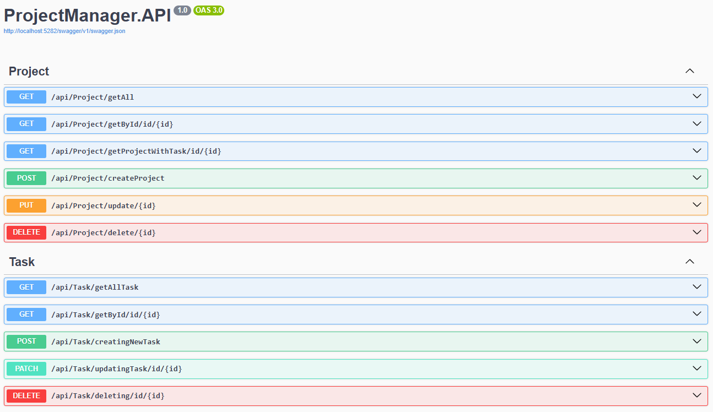
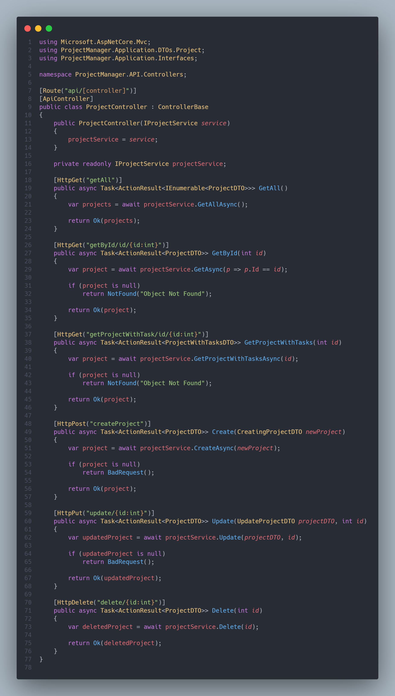
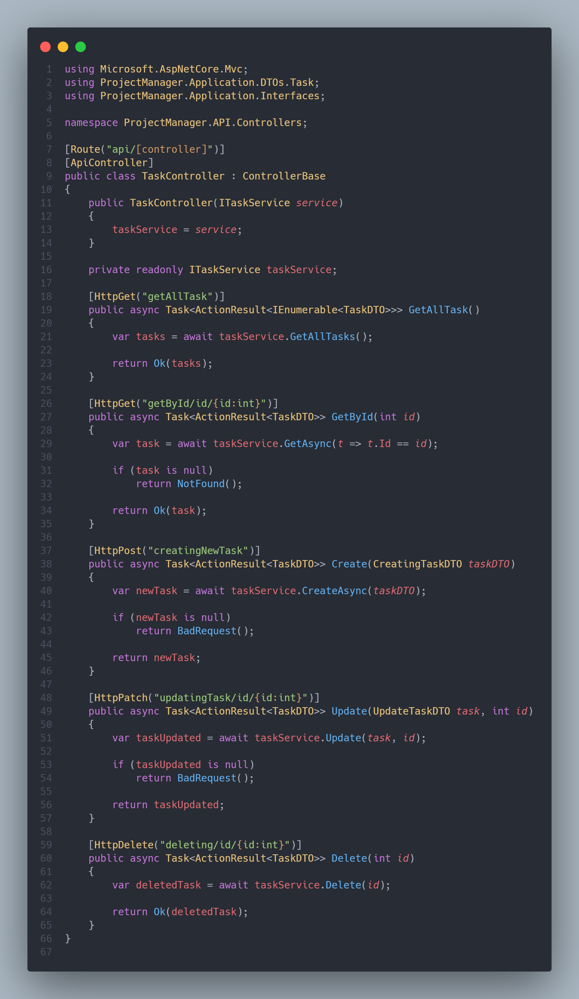
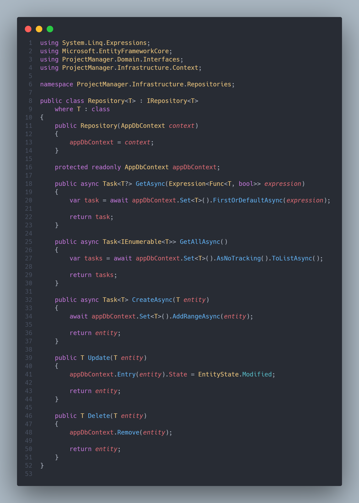
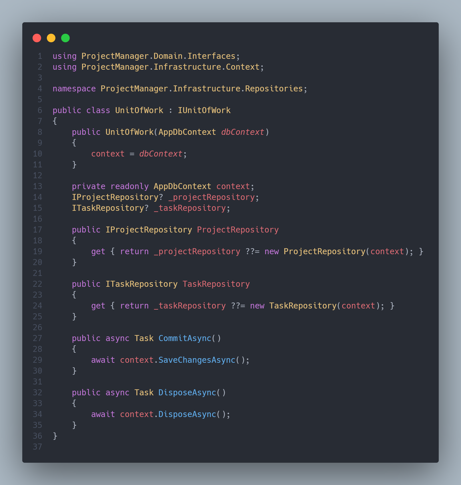

# ProjectManager-API

***"criei esse projeto para testar meus conhecimentos em clean architecture, RESTFull API E Docker"***

⚠️A UI será feito separada⚠️

 

 

***

## Alguns trechos de código

**Controllers**

- `ProjectController`

- `TaskController`

**Generic Repository**

- `Unit Of Work`

***

***ainda estou vou fazer a parte de login de usuário***